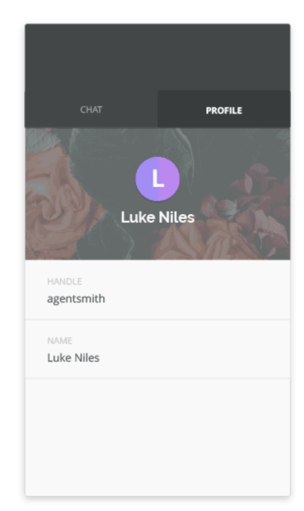
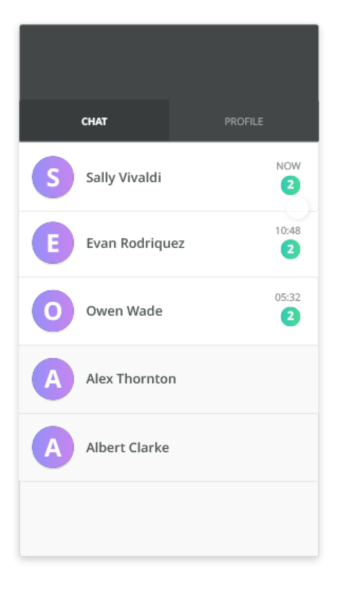
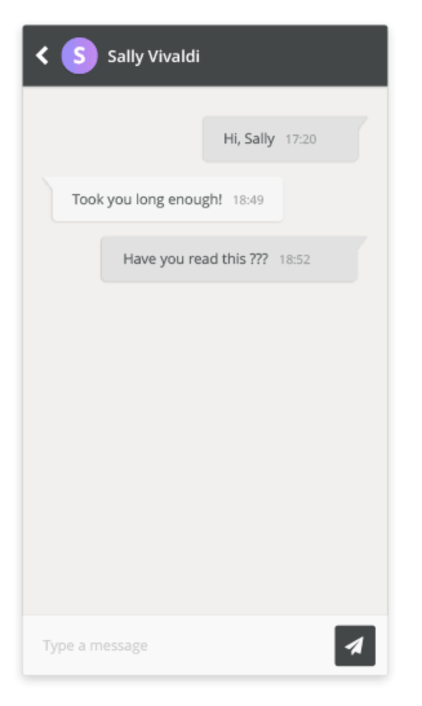

# Esercizio: client web di messaggistica minimale

L'app dovrà essere una Single Page Application sviluppata React.js.

Per il controllo di revisione andrà utilizzato git e un pattern a scelta tra git-flow e github-flow (pull requests).

Il passaggio da una schermata all'altra dovrà essere gestito da un router html5 (no hashbang), dovrà inoltre essere possibile l'accesso alle rotte descritte anche ricaricando completamente la pagina.

Il frame che conterrà l'app dovrà avere un viewport simil-mobile, centrato verticalmente e orizzontalmente nella pagina che lo ospita.

Per la definizione dello stile potranno essere utilizzati:
  - classNames con l'ausilio di preprocessori css (less o sass), utilizzando pattern [ITCSS](https://www.xfive.co/blog/itcss-scalable-maintainable-css-architecture/) o OOCSS descrivendo le classi in [BEM notation](http://getbem.com/introduction/)
  - [aphrodite](https://github.com/Khan/aphrodite)
  - [styled-components](https://www.styled-components.com/)
  - inline style objects

Si lascia allo sviluppatore la massima libertà nella disposizione e personalizzazione grafica dei componenti nel caso in cui nessun vincolo sia stato specificato.

Il client dovrà collegarsi a [queste API](https://chat-server-challange.herokuapp.com/) seguendo le specifiche descritte nella pagina raggiungibile dal percorso radice.

Dovrà essere possibile fare il submit delle credenziali anche premendo il tasto invio.

L'autenticazione restituirà nella risposta un cookie di sessione che andrà passato in tutte le richieste successive per identificare la sessione.

Le [API](https://chat-server-challange.herokuapp.com/) messe a disposizione permettono l'accesso di più utenti da client diversi per effettuare le prove di comunicazione, di seguito le credenziali:

Username  | Password
--------- | --------
tizio     | tizio.secret
caio      | caio.secret
sempronio | sempronio.secret

Nella vista Dettaglio contatto andrà implementato uno script di aggiornamento periodico dello storico dei messaggi.

Sarebbe molto gradita una gestione centralizzata dello stato dell'applicazione utilizzando [Redux](https://redux.js.org/).

Potrà essere utilizzato un fork di questo repository come base di sviluppo oppure uno personale inizializzato a piacere o da uno scaffolder. 

## Struttura

```
.
├── Autenticazione
|   ├── Username
|   ├── Password
|   └── Tasto submit
├── Dashboard
|   ├── Header
|   |   └── Logo centrato
|   └── Tabs
|       ├── Lista contatti
|       |   ├── Avatar contatto
|       |   ├── Nome contatto
|       |   └── Numero di notifiche contatto
|       └── Profilo utente
|           ├── Immagine profilo
|           ├── Nickname
|           ├── Nome e cognome
|           └── Indirizzo email
└── Dettaglio contatto
    ├── Navbar
    |   ├── Tasto per tornare alla dashboard a sx
    |   └── Nome destinatario
    ├── Lista messaggi
    ├── Input invio messaggio
    └── Tasto invio messaggio
```

# Wireframes





